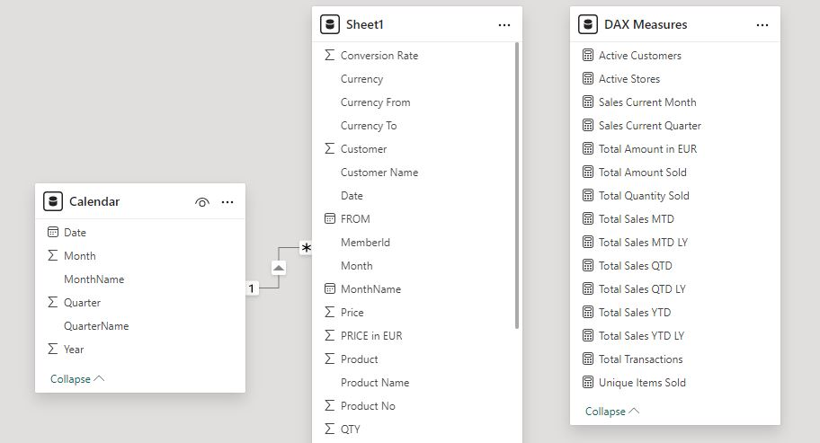
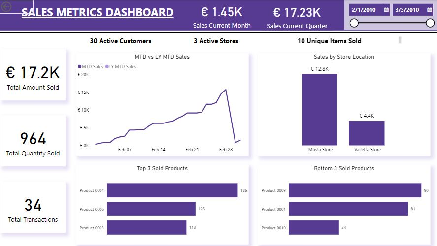
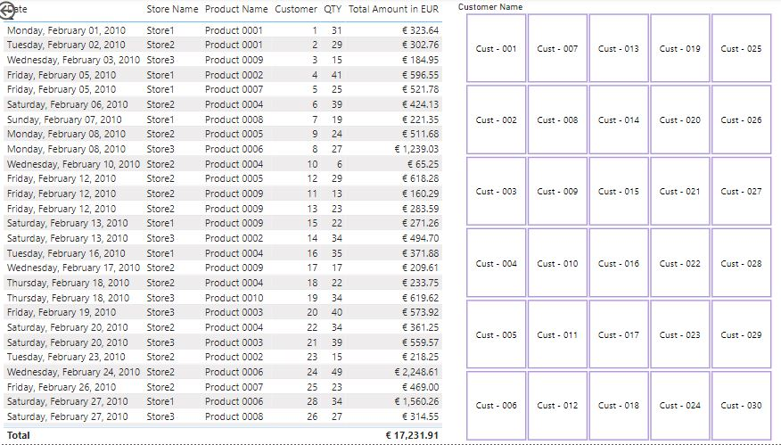

# Sales Metrics Report for KPI Measurement

## Project Overview:
This project involved creating a comprehensive Sales Metrics Report for a client who required a detailed analysis of their sales performance using **Power BI**. The report was designed to measure key performance indicators (KPIs) over a one-month period and to be used as a template for ongoing future sales dataset reports.  
The client's objective was to gain actionable insights from their sales data, which included visualizations and DAX measures to evaluate sales performance across various dimensions.  

### Project Objectives: 
- Develop a Power BI dashboard that effectively visualizes key sales metrics.
- Create DAX measures for calculating sales performance on a monthly, quarterly, and yearly basis.
- Implement time intelligence in the data model using a custom calendar table.
- Create columns to sort fields like months chronologically in charts.
- Provide insights on the top 3 and bottom 3 performing products.
- Standardize sales amounts across different currencies using a conversion rate to EUR. 

## Key DAX Measures Created:

- **_Sales for the Current Month:_**
 <pre> Sales for the Current Month = 
CALCULATE(
    [Total Amount in EUR],
    DATESMTD('Calendar'[Date])
)  </pre>

- **_Sales for the Current Quarter:_**
 <pre> Sales for the Current Quarter = 
CALCULATE(
    [Total Amount in EUR],
    DATESQTD('Calendar'[Date])
) </pre>

- **_Total Sales MTD (Month-to-Date) vs Same Period Last Year (MTD LY):_**
 <pre> Total Sales MTD = 
CALCULATE(
    [Total Amount in EUR],
    DATESMTD('Calendar'[Date])
)

Total Sales MTD LY = 
CALCULATE(
    [Total Amount in EUR],
    SAMEPERIODLASTYEAR(DATESMTD('Calendar'[Date]))
) </pre>

- **_Total Sales QTD (Quarter-to-Date) vs Same Period Last Year (QTD LY):_**
 <pre> Total Sales QTD = 
CALCULATE(
    [Total Amount in EUR],
    DATESQTD('Calendar'[Date])
)

Total Sales QTD LY = 
CALCULATE(
    [Total Amount in EUR],
    SAMEPERIODLASTYEAR(DATESQTD('Calendar'[Date]))
) </pre>

- **_Total Sales YTD (Year-to-Date) vs Same Period Last Year (YTD LY):_**
 <pre> Total Sales YTD = 
CALCULATE(
    [Total Amount in EUR],
    DATESYTD('Calendar'[Date])
)

Total Sales YTD LY = 
CALCULATE(
    [Total Amount in EUR],
    SAMEPERIODLASTYEAR(DATESYTD('Calendar'[Date]))
) </pre>

- **_Active Stores:_**
 <pre> Active Stores = DISTINCTCOUNT('Sheet1'[Store])
   </pre>

- **_Active Customers:_**
 <pre> Active Customers = DISTINCTCOUNT('Sheet1'[Customer])
   </pre>

- **_Unique Items Sold:_**
 <pre> Unique Items Sold = DISTINCTCOUNT('Sheet1'[Product No])
   </pre>

- **_Total Quantity Sold:_**
 <pre> Total Quantity Sold = SUM('Sheet1'[QTY])
   </pre>

- **_Total Transactions:_**
 <pre> Total Transactions = COUNTROWS('Sheet1')
   </pre>

- **_Total Amount in EUR:_**
 <pre> Total Amount in EUR = SUMX('Sheet1', 'Sheet1'[QTY] * 'Sheet1'[PRICE in EUR])
   </pre>
 
- **_Total Amount Sold:_**
 <pre> Total Amount Sold = [Total Amount in EUR]
   </pre>

## Data Model and Time Intelligence:

A custom calendar table was created to implement time intelligence, ensuring accurate date-based calculations. The calendar table was linked to the sales data with a 1-to-many relationship, allowing for dynamic analysis of the data across various time periods (MTD, QTD, YTD).

## Visualizations:

- **KPI Dashboard:** The dashboard includes key visualizations such as line charts, bar charts, and KPI cards to display sales metrics like total sales, active stores, unique items sold, and more.
- **Top 3 and Bottom 3 Products:** Special visualizations were created to highlight the top 3 and bottom 3 performing products, providing the client with insights into their best and worst sellers.
- **Currency Standardization:** Sales data from different currencies were converted to EUR using a predefined conversion rate, ensuring consistent reporting across the dataset.

## Outcome:
The Sales Metrics Report provided the client with a clear and comprehensive view of their sales performance. The dynamic dashboard and DAX measures allowed for easy tracking of KPIs, enabling the client to make informed decisions based on real-time data. The template created is also scalable, allowing the client to continue using it for future sales datasets with minimal adjustments.

## To help the client effectively use the Power BI template for new sales datasets, here are the steps they can follow for both scenarios: (1) when the datasets are in a folder, and (2) when they are all in one dataset.

### Scenario 1: Monthly Datasets Stored in a Folder
If the client stores individual monthly datasets as separate files within a single folder, the following steps should be followed to update the Power BI report:

#### 1. Organize the Folder:
- Ensure that all monthly datasets are saved in one folder. The datasets should have consistent column names and data formats.

#### 2. Load Data from the Folder:
- Open Power BI and navigate to the Home tab.
- Select Get Data > Folder.
- Browse to and select the folder containing the monthly datasets.

#### 3. Combine and Transform Data:
- Power BI will automatically detect all the files in the selected folder. Choose Combine & Load to merge the data from these files into a single dataset within Power BI.
- If necessary, use the Power Query Editor to clean and standardize the data.

#### 4. Refresh the Power BI Report:
- After combining the data, click Close & Load to bring the updated data into Power BI.
- The Power BI template will automatically update all visualizations and DAX measures with the newly combined data.
- For future updates, simply add new monthly datasets to the folder and click Refresh in Power BI to integrate the latest data.

#### 5. Save and Distribute the Report:
- Save the updated report in Power BI.
- The client can then distribute the report or publish it to Power BI Service for easy online access.

### Scenario 2: All Monthly Data Combined into a Single Dataset
If the client combines all monthly data into a single dataset (e.g., an Excel or CSV file), the following steps should be taken:

#### 1. Replace the Existing Dataset:
- Open Power BI and go to the Home tab.
- Select Get Data > Excel or Text/CSV (depending on the file format).
- Load the combined dataset by navigating to the appropriate file.

#### 2. Ensure Data Consistency:
- Verify that the new dataset has the same structure as the dataset initially used in the Power BI template.
- Use Power Query to adjust data types and apply any necessary transformations to maintain consistency.

#### 3. Refresh the Data Model:
- Once the new dataset is loaded, Power BI will refresh the data model, automatically updating all visualizations and DAX measures.
- Address any discrepancies that may arise (such as missing columns or incompatible data types) before completing the refresh.

#### 4. Save and Share the Updated Report:
- After refreshing, save the updated Power BI report.
- The client can share the report with stakeholders or publish it to Power BI Service for continuous access.
