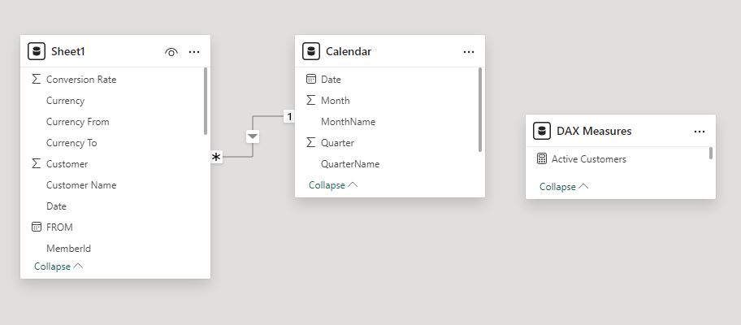

# Sales Metrics Report for KPI Measurement

## Project Overview:
This project involved creating a comprehensive Sales Metrics Report for a client who required a detailed analysis of their sales performance using Power BI. The report was designed to measure key performance indicators (KPIs) over a one-month period and to be used as a template for ongoing future sales dataset reports. The client's objective was to gain actionable insights from their sales data, which included visualizations and DAX measures to evaluate sales performance across various dimensions.

### Project Objectives:
- Develop a Power BI dashboard that effectively visualizes key sales metrics.
- Create DAX measures for calculating sales performance on a monthly, quarterly, and yearly basis.
- Implement time intelligence in the data model using a custom calendar table.
- Provide insights on the top 3 and bottom 3 performing products.
- Standardize sales amounts across different currencies using a conversion rate to EUR.

## Key DAX Measures Created:

*Sales for the Current Month:*
 <pre> Sales for the Current Month = 
CALCULATE(
    [Total Amount in EUR],
    DATESMTD('Calendar'[Date])
)  </pre>

*Sales for the Current Quarter:*
 <pre> Sales for the Current Quarter = 
CALCULATE(
    [Total Amount in EUR],
    DATESQTD('Calendar'[Date])
) </pre>

*Total Sales MTD (Month-to-Date) vs Same Period Last Year (MTD LY):*
 <pre> Total Sales MTD = 
CALCULATE(
    [Total Amount in EUR],
    DATESMTD('Calendar'[Date])
)

Total Sales MTD LY = 
CALCULATE(
    [Total Amount in EUR],
    SAMEPERIODLASTYEAR(DATESMTD('Calendar'[Date]))
) </pre>

*Total Sales QTD (Quarter-to-Date) vs Same Period Last Year (QTD LY):*
 <pre> Total Sales QTD = 
CALCULATE(
    [Total Amount in EUR],
    DATESQTD('Calendar'[Date])
)

Total Sales QTD LY = 
CALCULATE(
    [Total Amount in EUR],
    SAMEPERIODLASTYEAR(DATESQTD('Calendar'[Date]))
) </pre>

*Total Sales YTD (Year-to-Date) vs Same Period Last Year (YTD LY):*
 <pre> Total Sales YTD = 
CALCULATE(
    [Total Amount in EUR],
    DATESYTD('Calendar'[Date])
)

Total Sales YTD LY = 
CALCULATE(
    [Total Amount in EUR],
    SAMEPERIODLASTYEAR(DATESYTD('Calendar'[Date]))
) </pre>

*Active Stores:*
 <pre> Active Stores = DISTINCTCOUNT('Sheet1'[Store])
   </pre>

*Active Customers:*
 <pre> Active Customers = DISTINCTCOUNT('Sheet1'[Customer])
   </pre>

*Unique Items Sold:*
 <pre> Unique Items Sold = DISTINCTCOUNT('Sheet1'[Product No])
   </pre>

*Total Quantity Sold:*
 <pre> Total Quantity Sold = SUM('Sheet1'[QTY])
   </pre>

*Total Transactions:*
 <pre> Total Transactions = COUNTROWS('Sheet1')
   </pre>

*Total Amount in EUR:*
 <pre> Total Amount in EUR = SUMX('Sheet1', 'Sheet1'[QTY] * 'Sheet1'[PRICE in EUR])
   </pre>
 
*Total Amount Sold:*
 <pre> Total Amount Sold = [Total Amount in EUR]
   </pre>

## Data Model and Time Intelligence:

A custom calendar table was created to implement time intelligence, ensuring accurate date-based calculations. The calendar table was linked to the sales data with a 1-to-many relationship, allowing for dynamic analysis of the data across various time periods (MTD, QTD, YTD).

## Visualizations:

- KPI Dashboard: The dashboard includes key visualizations such as line charts, bar charts, and KPI cards to display sales metrics like total sales, active stores, unique items sold, and more.
- Top 3 and Bottom 3 Products: Special visualizations were created to highlight the top 3 and bottom 3 performing products, providing the client with insights into their best and worst sellers.
- Currency Standardization: Sales data from different currencies were converted to EUR using a predefined conversion rate, ensuring consistent reporting across the dataset.

## Outcome:
The Sales Metrics Report provided the client with a clear and comprehensive view of their sales performance. The dynamic dashboard and DAX measures allowed for easy tracking of KPIs, enabling the client to make informed decisions based on real-time data. The template created is also scalable, allowing the client to continue using it for future sales datasets with minimal adjustments.

